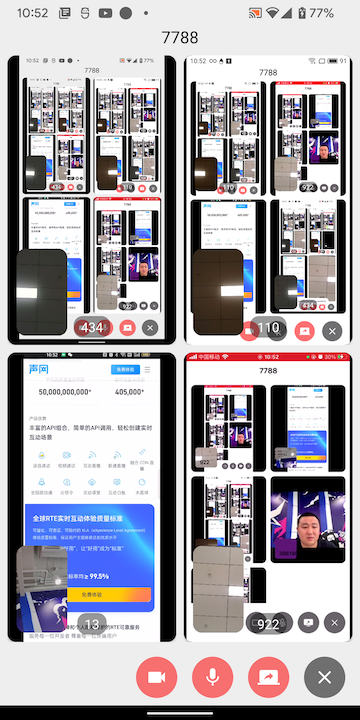

# MultiScreen

## 教程说明
了解最新屏幕共享API，学会同时共享多屏幕来减少开会中来回切换屏幕的烦恼。

**RTC版本：4.0.0-rc.1**

### 任务列表
- 配置APP ID，使用临时Token(可选)
- 初始化 RtcEngine
- 开启/预览摄像头
- 加入主频道并推摄像头视频源，退出主频道
- 开启/预览/关闭屏幕共享
- 加入Ex频道并推屏幕共享视频源，退出Ex频道
- 本地视频开启/关闭控制
- 本地音频开启/关闭控制
- 销毁 RtcEngine

### 效果




## 快速上手

### 准备环境
- [Android Studio Chipmunk](https://developer.android.com/studio#downloads)
- [JDK 11](https://www.oracle.com/java/technologies/javase/jdk11-archive-downloads.html)
- 在[控制台](https://console.agora.io/)上注册项目并获取APP ID
- (可选)若开启了Token认证，需要[获取临时Token](https://docs.agora.io/cn/Agora%20Platform/get_appid_token?platform=All%20Platforms#%E8%8E%B7%E5%8F%96-rtc-%E4%B8%B4%E6%97%B6-token)
- (可选)若手动集成，[下载rtc sdk](https://download.agora.io/sdk/release/Agora_Native_SDK_for_Android_v4.0.0-rc.1_FULL.zip)

### 实现步骤

#### 1 配置appId、临时Token(可选)
在[app/src/main/res/values/strings_config.xml](app/src/main/res/values/strings_config.xml)下配置
```
<string name="agora_rtc_app_id"><=YOUR APP ID=></string>
<string name="agora_rtc_token"><=Your ACCESS TOKEN=></string>
```
**PS：没有临时Token，agora_rtc_token留空。如果开启了临时Token，在加入频道时要使用申请临时Token时使用的ChannelId**

#### 2 初始化 RtcEngine
```java
RtcEngineConfig config = new RtcEngineConfig();
config.mContext = getApplicationContext();
config.mAppId = getString(R.string.agora_rtc_app_id);
config.mEventHandler = mMainEventHandler;
config.mAreaCode = RtcEngineConfig.AreaCode.AREA_CODE_GLOB;
config.mChannelProfile = Constants.CHANNEL_PROFILE_LIVE_BROADCASTING;
try {
    rtcEngine = (RtcEngineEx) RtcEngine.create(config);
    rtcEngine.enableVideo();
    rtcEngine.enableAudio();
    rtcEngine.setDefaultAudioRoutetoSpeakerphone(true);
} catch (Exception e) {
    e.printStackTrace();
}
```

#### 3 开启/预览摄像头
```java
rtcEngine.setupLocalVideo(new VideoCanvas(renderView, 									
								Constants.RENDER_MODE_HIDDEN, 
								Constants.VIDEO_MIRROR_MODE_AUTO,
                Constants.VIDEO_SOURCE_CAMERA_PRIMARY, 
                seatUid));
rtcEngine.startPreview(Constants.VideoSourceType.VIDEO_SOURCE_CAMERA_PRIMARY);
```

#### 4 开启/预览/关闭屏幕共享
##### 4.1 开启屏幕共享
```java
ScreenCaptureParameters parameters = new ScreenCaptureParameters();
DisplayMetrics metrics = new DisplayMetrics();
getWindowManager().getDefaultDisplay().getRealMetrics(metrics);
parameters.captureVideo = true;
parameters.videoCaptureParameters.width = 720;
parameters.videoCaptureParameters.height = (int) (720 * 1.0f / metrics.widthPixels * metrics.heightPixels);
parameters.videoCaptureParameters.framerate = 15;
parameters.captureAudio = false;
parameters.audioCaptureParameters.captureSignalVolume = 50;
rtcEngine.startScreenCapture(parameters);
```

##### 4.2 预览屏幕共享
```java
rtcEngine.setupLocalVideo(new VideoCanvas(renderView, Constants.RENDER_MODE_FIT, Constants.VIDEO_MIRROR_MODE_DISABLED,
                    Constants.VIDEO_SOURCE_SCREEN_PRIMARY, uid));
           rtcEngine.startPreview(Constants.VideoSourceType.VIDEO_SOURCE_SCREEN_PRIMARY);
```

##### 4.3 关闭屏幕共享
```java
rtcEngine.stopScreenCapture();
```


#### 5 加入Ex频道并推屏幕共享视频源，退出Ex频道
##### 5.1 加入Ex频道并推屏幕共享视频
```java
ChannelMediaOptions options = new ChannelMediaOptions();
options.clientRoleType = Constants.CLIENT_ROLE_BROADCASTER;
options.autoSubscribeVideo = false;
options.autoSubscribeAudio = false;
options.publishScreenCaptureVideo = true;
options.publishScreenCaptureAudio = false;
mScreenConnection = new RtcConnection();
mScreenConnection.channelId = mChannelId;
mScreenConnection.localUid = screenUid;
rtcEngine.joinChannelEx(getString(R.string.agora_rtc_token), 	
			mScreenConnection, options, new IRtcEngineEventHandler() {});
```

##### 5.2 退出Ex频道
```java
if (mScreenConnection != null) {
    rtcEngine.leaveChannelEx(mScreenConnection);
    mScreenConnection = null;
}
```

#### 6 本地视频开启/关闭控制
```java
mMainChannelOptions.publishCameraTrack = enableVideo;
rtcEngine.updateChannelMediaOptions(mMainChannelOptions);
```

#### 7 本地音频开启/关闭控制
```java
mMainChannelOptions.publishMicrophoneTrack = enableAudio;
rtcEngine.updateChannelMediaOptions(mMainChannelOptions);
```

#### 8 销毁 RtcEngine
```java
RtcEngine.destroy();
```

## 参考文档

- [RTC Java SDK 产品概述](https://docs.agora.io/cn/video-call-4.x/landing-page?platform=Android)
- [RTC Java SDK API 参考](https://docs.agora.io/cn/video-call-4.x/api-ref?platform=Android)

## 相关资源

- 如果你想了解更多官方示例，可以参考 [官方 SDK 示例](https://github.com/AgoraIO/API-Examples/tree/4.0.0-GA/Android/APIExample/app/src/main/java/io/agora/api/example/examples/advanced/customaudio)
- 如果你想了解声网 SDK 在复杂场景下的应用，可以参考 [官方场景案例](https://github.com/AgoraIO-usecase)

## 代码许可

示例项目遵守 MIT 许可证。