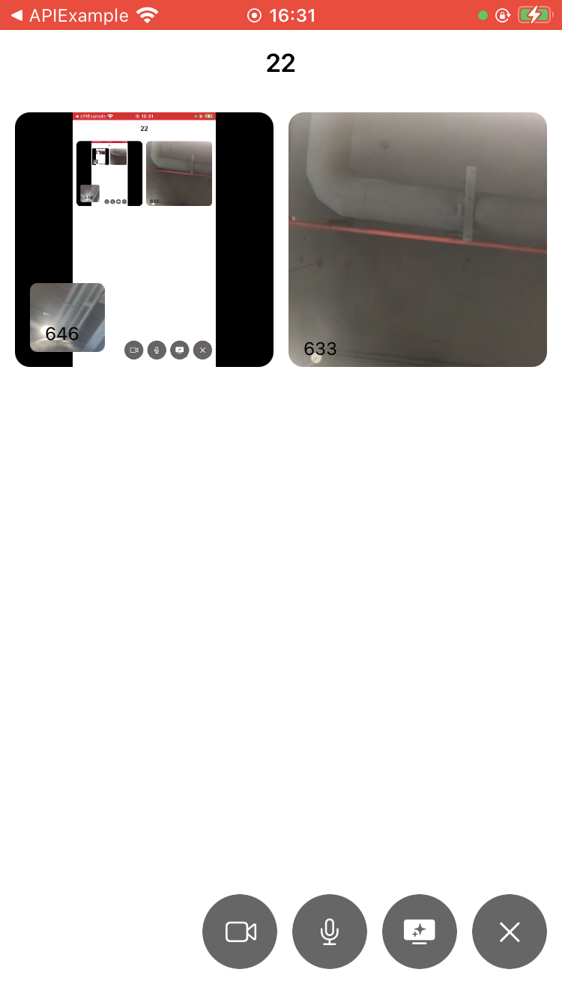

### MultiScreen

## 教程说明

了解最新屏幕共享API，学会同时共享多屏幕来减少开会中来回切换屏幕的烦恼。
**RTC版本：4.0.0-rc.1**

### 任务列表

- 配置APP ID，使用临时Token(可选)
- 执行 pod install
- 初始化 RtcEngine
- 初始化系统屏幕共享 `RPSystemBroadcastPickerView`
- 加入主频道并推摄像头视频源，退出主频道
- 开启/预览/关闭屏幕共享
- 加入Ex频道并推屏幕共享视频源，退出Ex频道

### 效果



## 快速上手

### 准备环境

- Xcode 13.0 (推荐最新版)
- 在[控制台](https://console.agora.io/)上注册项目并获取APP ID
- (可选)若开启了Token认证，需要[获取临时Token](https://docs.agora.io/cn/Agora%20Platform/get_appid_token?platform=All%20Platforms#%E8%8E%B7%E5%8F%96-rtc-%E4%B8%B4%E6%97%B6-token)
- (可选)若手动集成，[下载rtc sdk](https://download.agora.io/sdk/release/Agora_Native_SDK_for_iOS_v4.0.0-rc.1_FULL.zip)

### 实现步骤

#### 1. 配置appId、临时Token(可选)

编辑 `KeyCenter.swift文件`
    - 将 `<=YOUR APPID=>` 替换为你的 RTC App ID。
    - 将 `<=YOUR Token=>` 替换为你的 RTC Token
    - 如果开启了token，需要获取 App 证书并设置给`Token`

```swift
 static let AppId: String = <# YOUR APPID#>

 // assign token to nil if you have not enabled app certificate
 static var Token: String? = <#YOUR TOKEN#>
```

<br/>

#### 2. 初始化RtcEngineKit

```swift
agoraKit = AgoraRtcEngineKit.sharedEngine(with: rtcEngineConfig, delegate: self)
agoraKit?.setClientRole(.broadcaster)
agoraKit?.setChannelProfile(.liveBroadcasting)
agoraKit?.enableVideo()
agoraKit?.enableAudio()
/// 开启扬声器
agoraKit?.setDefaultAudioRouteToSpeakerphone(true)
```

#### 

#### 3.初始化系统屏幕共享

```swift
let frame = CGRect(x: 0, y:0, width: 0, height: 0)
systemBroadcastPicker = RPSystemBroadcastPickerView(frame: frame)
systemBroadcastPicker?.showsMicrophoneButton = false
systemBroadcastPicker?.autoresizingMask = [.flexibleTopMargin, .flexibleRightMargin]
let bundleId = Bundle.main.bundleIdentifier ?? ""
systemBroadcastPicker?.preferredExtension = "\(bundleId).Agora-ScreenShare-Extension";
```

<br/>

#### 4. 开启/关闭屏幕共享

1. 开始屏幕共享
   ```swift
   let params = AgoraScreenCaptureParameters2()
   params.captureVideo = true
   params.captureAudio = true
   let audioParams = AgoraScreenAudioParameters()
   audioParams.captureSignalVolume = 50
   params.audioParams = audioParams
   let videoParams = AgoraScreenVideoParameters()
   videoParams.frameRate = .fps30
   videoParams.bitrate = AgoraVideoBitrateStandard
   
   agoraKit?.startScreenCapture(params)
   ```

2. 停止屏幕共享
   ```swift
   agoraKit?.stopScreenCapture()
   screenChannelMediaOptions.publishCustomVideoTrack = .of(false)
   agoraKit?.updateChannel(with: screenChannelMediaOptions)
   leaveChannel(uid: UserInfo.userId + screenUid)
   ```

<br/>

#### 5. 加入Ex频道并推屏幕共享视频源，退出Ex频道

1. 加入频道
   ```swift
   let connection = AgoraRtcConnection()
   connection.channelId = channelName
   connection.localUid = uid
   let result = agoraKit?.joinChannelEx(byToken: KeyCenter.Token,
                                        connection: connection,
                                        delegate: self,
                                        mediaOptions: mediaOption,
                                        joinSuccess: nil)
   ```

2. 退出频道
   ```swift
   let connection = AgoraRtcConnection()
   connection.channelId = channelName
   connection.localUid = uid
   agoraKit?.leaveChannelEx(connection, leaveChannelBlock: { state in
       print("leave channel: \(state)")
   })
   ```

<br/>

## 参考文档

- [RTC iOS SDK 产品概述](https://docs.agora.io/cn/Interactive%20Broadcast/product_live?platform=iOS)
- [RTC iOS SDK API 参考](https://docs.agora.io/cn/Interactive%20Broadcast/API%20Reference/oc/docs/headers/Agora-Objective-C-API-Overview.html)

## 相关资源

- 你可以先参阅 [常见问题](https://docs.agora.io/cn/faq)
- 如果你想了解更多官方示例，可以参考 [官方 SDK 示例](https://github.com/AgoraIO)
- 如果你想了解声网 SDK 在复杂场景下的应用，可以参考 [官方场景案例](https://github.com/AgoraIO-usecase)
- 如果你想了解声网的一些社区开发者维护的项目，可以查看 [社区](https://github.com/AgoraIO-Community)
- 若遇到问题需要开发者帮助，你可以到 [开发者社区](https://rtcdeveloper.com/) 提问
- 如果需要售后技术支持, 你可以在 [Agora Dashboard](https://dashboard.agora.io) 提交工单

## 代码许可

示例项目遵守 MIT 许可证。
